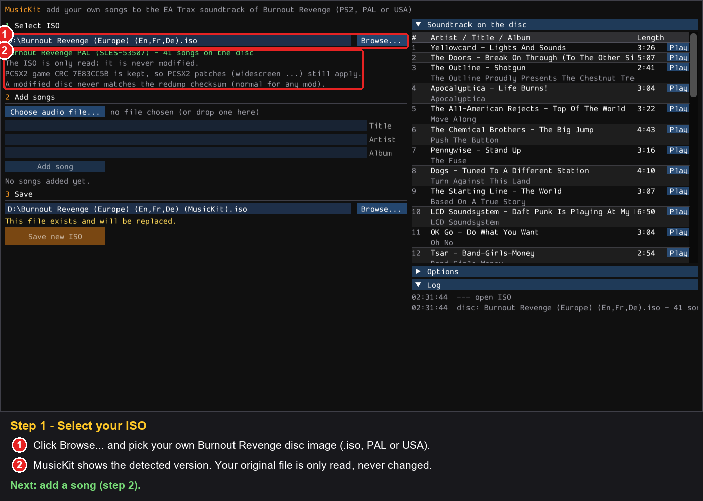
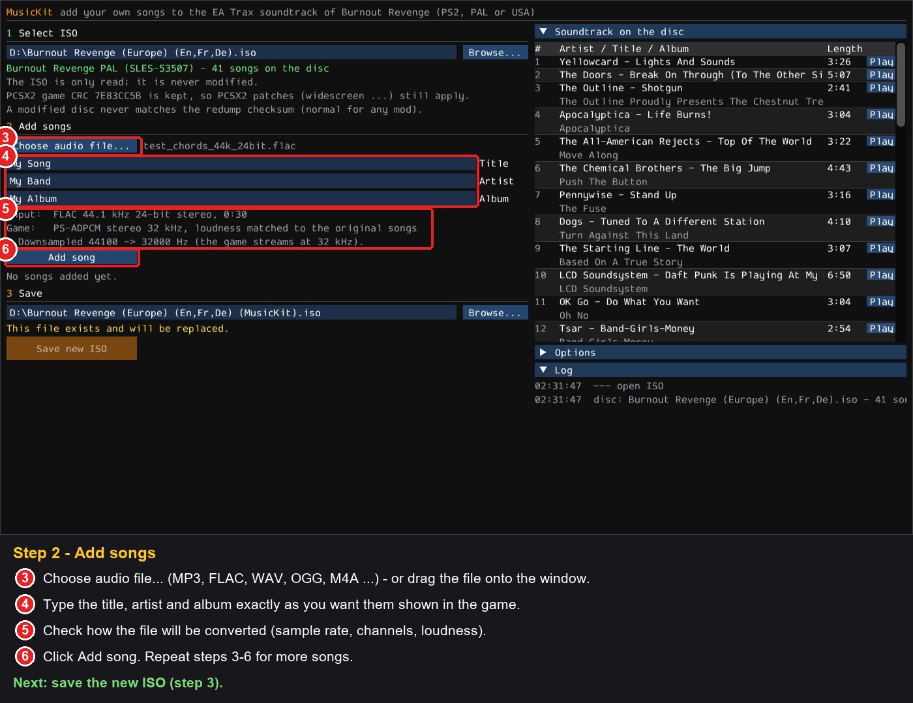
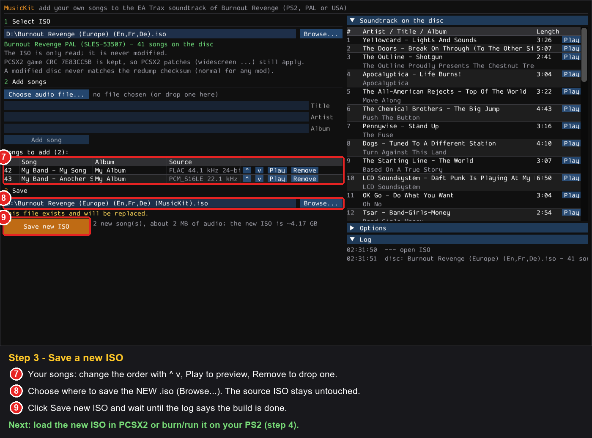
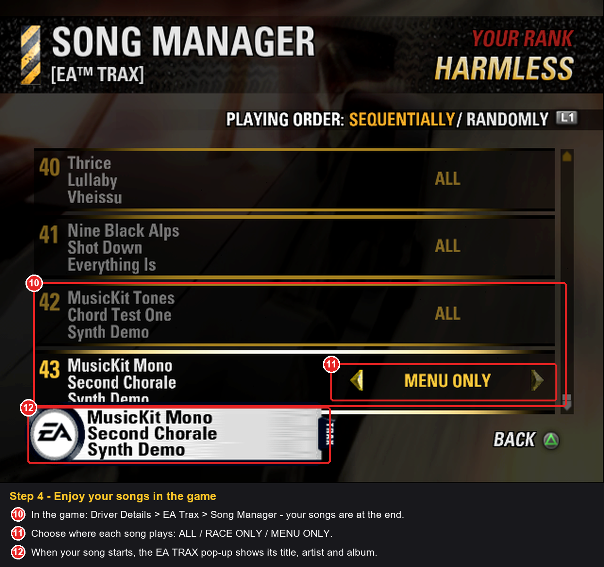

# MusicKit for Burnout Revenge (PS2)

**Add your own songs to the EA Trax soundtrack of Burnout Revenge** — with their title, artist and album — and
get a new disc image that plays them in the game just like the original songs: in menus and races, in the Song
Manager, and in the "EA TRAX" now-playing pop-up.

> **Unofficial fan-made tool.** Not affiliated with, endorsed or sponsored by Electronic Arts Inc. or Criterion
> Games. You need **your own copy** of the game. See [Legal](#legal) before you use or share anything.

- Works with your own disc image of **Burnout Revenge for PlayStation 2**:
  - Europe / PAL — `SLES-53507`
  - USA / NTSC — `SLUS-21242`
- Your original image is **only read, never modified**; MusicKit writes a **new** `.iso`.
- Songs: MP3, FLAC, WAV, OGG, M4A … (anything ffmpeg can read), up to 100 songs in total.
- The new image keeps the game's PCSX2 CRC (`7E83CC5B` PAL, `D224D348` USA), so **PCSX2 still recognises the game
  and applies its patches** (widescreen etc.).
- Tested in PCSX2 with both the PAL and the USA version.

---

## How it works — 4 steps

### Step 1 — Select your ISO


### Step 2 — Add songs


### Step 3 — Save a new ISO


### Step 4 — Play
Load the new `.iso` in PCSX2.
In the game open **Driver Details → EA Trax → Song Manager**.



---

## Requirements

| What | Details |
|---|---|
| Operating system | Windows 10 or 11 (64-bit) |
| Python | 3.11 or newer — <https://www.python.org/downloads/> |
| Python packages | installed automatically by `setup.bat` into a private `.venv`: numpy, numba, glfw, PyOpenGL, imgui-bundle, Pillow, soundfile, pyloudnorm, pycdlib (see [requirements.txt](requirements.txt)) |
| ffmpeg | downloaded automatically by `setup.bat` (or install it yourself: `winget install Gyan.FFmpeg`) |
| Graphics | any GPU with OpenGL 3.3 (for the MusicKit window) |
| Disk space | about 5 GB free for the new disc image (~4.2 GB) plus ~1 GB for Python packages and ffmpeg |
| The game | your own disc image (.iso) of Burnout Revenge for PS2: PAL `SLES-53507` or USA `SLUS-21242` |
| Internet | only once, during `setup.bat` |

## Installation (Windows 10 / 11)

1. Install **Python 3.11 or newer** from <https://www.python.org/downloads/> (tick *"Add python.exe to PATH"*).
2. Download this repository (green **Code** button → *Download ZIP*) and unpack it, or `git clone` it.
3. Double-click **`setup.bat`** once. It creates a private Python environment in `.venv` and downloads
   **ffmpeg** into the `ffmpeg` folder (used to read MP3/FLAC/OGG/… files). Nothing is installed system-wide.
   - If the ffmpeg download fails, install it yourself (`winget install Gyan.FFmpeg`) or put `ffmpeg.exe` and
     `ffprobe.exe` into `ffmpeg\bin`.
4. Start **`MusicKit.bat`**.

## Sound quality

The game streams its music as **PS2 ADPCM, stereo, 32 kHz** — every song is converted to that format:

| Your file | What happens |
|---|---|
| CD quality or better (44.1 / 48 / 96 kHz, 16/24-bit) | downsampled to 32 kHz (the best the game can play) |
| lower than 32 kHz (e.g. 22 kHz) | upsampled — it plays fine, but quality cannot get better than the source |
| mono | copied to both channels |
| more than 2 channels | mixed down to stereo |

Loudness is matched to the original EA Trax songs, so your songs are neither louder nor quieter than the rest
(you can turn this off under *Options*). Titles, artists and albums can be up to 60 characters; characters the
game's font does not have are replaced by the closest one (accents are kept).

## Command line (optional)

```bat
musickit-cli.bat list     --iso "Burnout Revenge (Europe).iso"
musickit-cli.bat add      song.flac --title "My Song" --artist "My Band" --album "My Album"
musickit-cli.bat queue
musickit-cli.bat build    --iso "Burnout Revenge (Europe).iso" --out "Burnout Revenge (MusicKit).iso" [--unlock-off]
musickit-cli.bat validate "Burnout Revenge (Europe).iso" "Burnout Revenge (MusicKit).iso"
```

`validate` re-reads the new image and checks it: the file system is consistent, every file MusicKit did not change
is byte-identical, the PCSX2 CRC is unchanged and the new songs decode.

## FAQ

**PCSX2 says the dump is not in the redump database / the MD5 is red.** That is expected for *any* modified disc
image — it simply is not the original pressing anymore. It does not affect the game or PCSX2 patches: the game CRC
(shown in PCSX2's game properties) stays the same.

**Can I add more songs later?** Yes. Open the image MusicKit made and add more; the songs already in it are kept.

**Will my save game still work?** Yes. Your original songs' settings stay where they are on the memory card; new
songs default to *ALL* (menus and races) and can be changed in the Song Manager.

**My songs don't show up.** Make sure you started the *new* `.iso`, and look at the end of the Song Manager list.

**I can't switch some original songs OFF.** That is how the original game works: the Song Manager only lets you
switch a song OFF after it has played to the end once (until then it can only be set to ALL / Menu only / Race
only). Songs added with MusicKit are never locked. To lift the lock for every song, tick **Options → Allow
switching any song OFF** before saving (command line: `build --unlock-off`). It can also be the only change: open
your image, tick the option and save, no new songs needed. The PCSX2 game CRC stays the same.

## Thanks

- [porkuskorpz](https://github.com/porkuskorpz) (u/porkuskorpz) for in-game testing and the detailed report that
  led to the *Allow switching any song OFF* option.

## Legal

**Please read this before using or sharing anything made with MusicKit.**

- **Unofficial project.** MusicKit is an independent, non-commercial fan project. It is not affiliated with,
  authorised, endorsed or sponsored by Electronic Arts Inc., Criterion Games or Sony Interactive Entertainment.
- **Trademarks.** "Burnout", "Burnout Revenge", "EA", "EA Trax" and related names and logos are trademarks of
  Electronic Arts Inc.; "PlayStation" and "PS2" are trademarks of Sony Interactive Entertainment. They are used
  here only to describe which game this tool works with. All other trademarks belong to their owners.
- **No game content is included.** This repository contains only original source code and documentation, plus
  screenshots used to illustrate how the tool works. It does not contain or distribute any part of the game —
  no disc images, executables, music, textures or other data.
- **Bring your own game.** You need your own, legally obtained copy of Burnout Revenge and must create the disc
  image from it yourself. MusicKit does not bypass any copy protection; it only edits a copy of your own image.
- **Do not share modified disc images.** Disc images contain the game, which is copyrighted by Electronic Arts.
  Uploading or distributing them — modified or not — is not allowed.
- **Music rights.** Songs belong to their artists and labels. Only add music you are allowed to use, keep your
  modified image for personal use, and do not distribute images or files that contain other people's music.
- **No warranty.** The software is provided "as is", without warranty of any kind (see [LICENSE](LICENSE)).
  Use it at your own risk; keep a backup of your original image and your memory card saves.
- **Licence.** The source code is released under the MIT License. The licence applies only to the code in this
  repository and grants no rights to the game or its content.

If you are a rights holder and have a concern about this project, please open an issue and it will be addressed
promptly.
